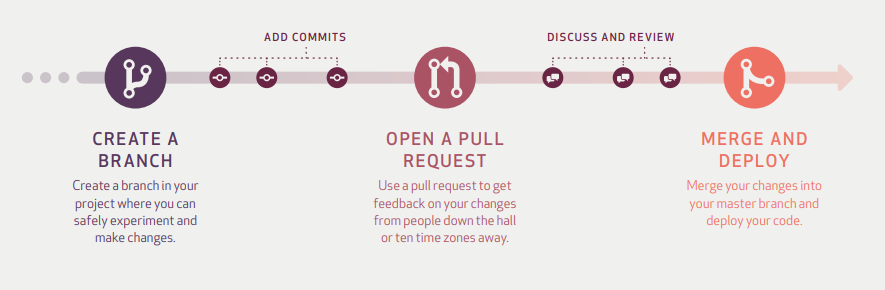

# GitHub flow

- Create a branch
- Add commits
- Open a Pull Request
- Discuss and review your code
- Deploy
- Merge

## 예제
1. 프로젝트를 Fork한다. 개인 저장소를 로컬에 Clone한다.
2. master 기반으로 토픽 브랜치를 만든다.
   1. 토픽 브랜치는 무슨 작업을 하는지 설명이 되어야 한다.
      1. ex) `refactor-authentication`, `user-content-cache-key`
3. 작성한 코드를 토픽 브랜치에 커밋한다.
4. 개인 저장소에 브랜치를 Push한다.
5. 원격 저장소에 Pull Request를 보낸다. 
6. 코드 리뷰를 하며 변경된 작업을 커밋한다.
7. 리뷰가 승인되면 Pull Request를 Merge하고 닫는다.

# 참고자료
- [GitHub 가이드](https://guides.github.com/introduction/flow/)
- [ProGit](https://git-scm.com/book/ko/v2/GitHub-GitHub-%ED%94%84%EB%A1%9C%EC%A0%9D%ED%8A%B8%EC%97%90-%EA%B8%B0%EC%97%AC%ED%95%98%EA%B8%B0)
